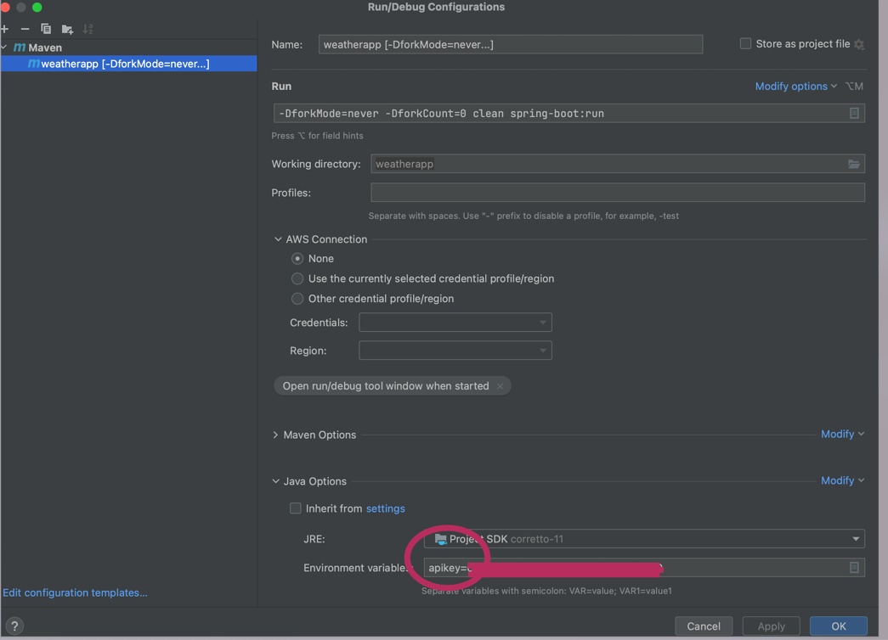
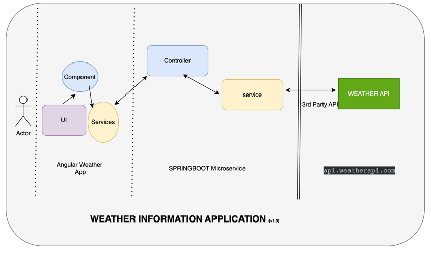

# Weather Information Application - Springboot Weather API consumed by Angular frontend

This project was based on Java11, Springboot2 and third party weather API ( api.weatherapi.com)

## Building and Running the Application 
Following are the maven commands to run springboot applications
mvn clean spring-boot:run
<br> Due to secuirty reason, 3rd party apikey is provided by env variable ( apikey). 

Following is run configuration:



## Information And Architecture about Application
This programme gives weather data based on location search criteria. User can weather searches for a valid location using query parameter.
<br>This weather data is provided by a Spring Boot api that accesses a third-party weather API internally. 
<br>Application uses this third-party API at api.weatherapi.com.

<br>The Springboot is running on http://localhost:8181/
<br>The Angular APP is running on http://localhost:4200/



## Accessing the Application
Please navigate to `http://localhost:8181/getweatherinfo?location=Norwich`.
<br> The location is coming from angular application but if developer wish to run springboot application alone then they need to set location in property file.
**location_to_replaced** need to be replaced by valid city in property file at src/main/resources/application.properties
<br> e.g. 

```urlparameters=key:{apikey}&q:location_to_replaced&aqi:no```
<br>should change to <br>
```urlparameters=key:{apikey}&q:Norwich&aqi:no```
